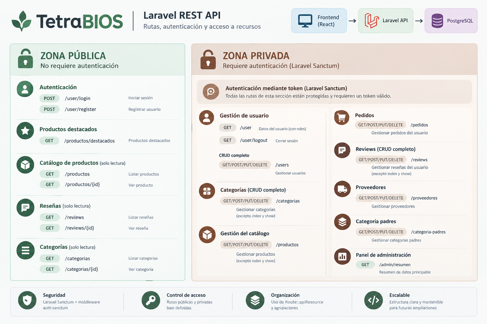
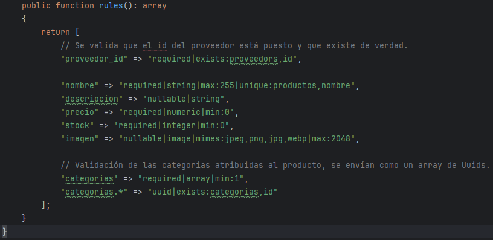
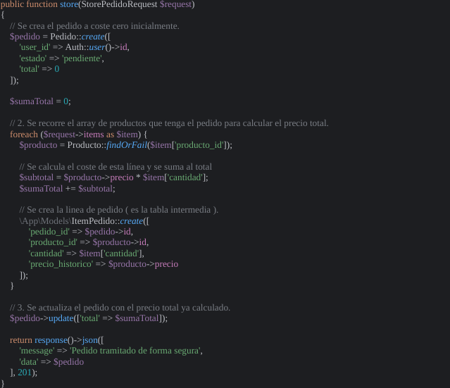
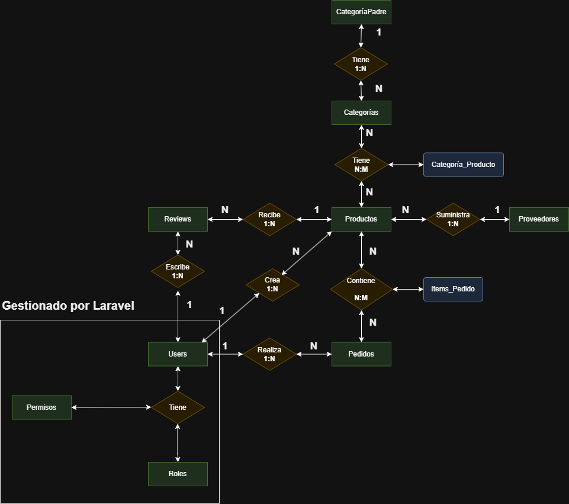
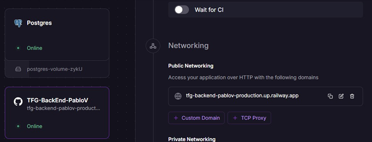

# 🌱 TetraBIOS — Backend

### Secure REST API for a B2B sustainable e-commerce platform

This repository contains the **backend REST API of TetraBIOS**, a B2B e-commerce platform focused on sustainable packaging and supplies.

The API was developed with **Laravel and PHP**, using **PostgreSQL** as its relational database. It centralizes authentication, authorization, validation, business logic and data persistence, while the React frontend consumes the API through HTTP/JSON requests.

TetraBIOS was developed individually as my **Final Degree Project (DAW)**.

---

## 🚀 Production

### API

🔗 **Railway:**
https://tfg-backend-pablov-production.up.railway.app

### Frontend

🔗 **Live application:**
https://tetrabios-pablo-v.vercel.app/

### Frontend repository

https://github.com/PabloVidalOrtega/TFG-FrontEnd-PabloV

---

## 🧠 Backend Overview

The main design principle behind the API is:

> **Never trust the client.**

Critical business rules are handled on the server instead of relying on values sent by the frontend.

The backend is responsible for:

* Authentication.
* Authorization.
* Request validation.
* Business logic.
* Product and inventory management.
* Supplier management.
* Categories.
* Orders.
* Reviews.
* Database persistence.
* Image storage.
* Structured API responses.

This allows the same API to be reused by different clients in the future, such as a web application or a mobile application.

---

## 🏗️ Architecture

TetraBIOS follows a **client-server architecture** using a RESTful API.

```text
┌────────────────────────────┐
│        React Frontend      │
│       Vite + Tailwind      │
└──────────────┬─────────────┘
               │
               │ HTTP / JSON
               ▼
┌────────────────────────────┐
│       Laravel REST API     │
│                            │
│ Authentication             │
│ Authorization              │
│ Validation                 │
│ Business Logic             │
│ Eloquent ORM               │
└──────────────┬─────────────┘
               │
               ▼
┌────────────────────────────┐
│         PostgreSQL         │
└────────────────────────────┘
```

The frontend is responsible for presentation and user interaction, while the backend acts as the central authority for data and business rules.

---

## 🛠️ Tech Stack

### Backend

| Technology                | Purpose                               |
| ------------------------- | ------------------------------------- |
| PHP                       | Backend programming language          |
| Laravel                   | REST API and application architecture |
| Eloquent ORM              | Database interaction                  |
| Laravel Sanctum           | Token-based authentication            |
| Spatie Laravel Permission | Roles and permissions                 |
| Form Requests             | Validation and authorization          |
| Laravel Seeders           | Database initialization               |
| Laravel Factories         | Test/development data generation      |

### Database

| Technology | Purpose                               |
| ---------- | ------------------------------------- |
| PostgreSQL | Relational database                   |
| UUID       | Primary identifiers for main entities |

### Development & Deployment

| Technology      | Purpose                       |
| --------------- | ----------------------------- |
| Git             | Version control               |
| GitHub          | Repository and source control |
| Postman         | API testing                   |
| Railway         | API and PostgreSQL deployment |
| Laravel Storage | Product image storage         |

---

## 🔐 Authentication & Authorization

Authentication is implemented using **Laravel Sanctum**.

When a user successfully logs in, the API generates a token that the frontend uses in subsequent authenticated requests.

```text
POST /api/user/login
        │
        ▼
   Credentials
        │
        ▼
 Laravel Sanctum
        │
        ▼
   Bearer Token
        │
        ▼
Authenticated Requests
```

Protected endpoints are grouped using Laravel's authentication middleware:

```php
Route::middleware('auth:sanctum')->group(function () {
    // Protected routes...
});
```

### Roles & Permissions

Authorization is implemented using **Spatie Laravel Permission**.

The application currently distinguishes between:

* `admin`
* regular users / clients

Permissions can also be assigned independently of a role, allowing the authorization system to grow without coupling every action exclusively to a role.

For example:

```php
if ($user->hasRole('admin')) {
    return true;
}

return $user->hasPermissionTo('gestionar-catalogo');
```

This allows permissions such as catalogue or review management to be handled independently when required.

---

## 🌐 API Access Levels

The API is divided into two main areas.



### 🌱 Public API

Public endpoints allow users to browse the catalogue without authentication.

Examples:

```text
POST  /api/user/login
POST  /api/user/register

GET   /api/productos
GET   /api/productos/{id}

GET   /api/productos/destacados

GET   /api/categorias
GET   /api/categorias/{id}

GET   /api/reviews
GET   /api/reviews/{id}
```

These routes are mainly intended for catalogue discovery and public content.

### 🔒 Protected API

Authenticated endpoints are grouped under:

```text
auth:sanctum
```

Protected resources include:

```text
GET     /api/user
GET     /api/user/logout

CRUD    /api/users
CRUD    /api/categorias
CRUD    /api/productos
CRUD    /api/pedidos
CRUD    /api/reviews
CRUD    /api/proveedores
CRUD    /api/categoria-padres

GET     /api/admin/resumen
```

Access to individual operations is additionally controlled through roles and permissions.

---

## 🛡️ Request Validation

Incoming requests are validated before reaching the controller.

Laravel **Form Requests** are used to centralize validation and authorization rules.

Example:

```php
public function rules(): array
{
    return [
        'proveedor_id' => 'required|exists:proveedors,id',
        'nombre' => 'required|string|max:255|unique:productos,nombre',
        'descripcion' => 'nullable|string',
        'precio' => 'required|numeric|min:0',
        'stock' => 'required|integer|min:0',
        'imagen' => 'nullable|image|mimes:jpeg,png,jpg,webp|max:2048',
        'categorias' => 'required|array|min:1',
        'categorias.*' => 'uuid|exists:categorias,id'
    ];
}
```

Authorization rules are also handled in the corresponding request classes.

This keeps controllers focused on business operations instead of mixing validation, authorization and persistence logic together.



---

## 💰 Business Logic & Order Security

One of the most important backend decisions is that **the client never determines the final order price**.

When an order is created, the server:

1. Receives the requested products and quantities.
2. Retrieves the real product information from the database.
3. Uses the current database price.
4. Calculates each line subtotal.
5. Calculates the final order total.
6. Stores the historical product price.

Simplified flow:

```text
Frontend
   │
   │ product ID + quantity
   ▼
Laravel API
   │
   ▼
PostgreSQL
   │
   │ current price
   ▼
Server-side calculation
   │
   ├── subtotal
   ├── historical price
   └── final total
   ▼
Order created
```

This prevents a client from modifying the total price sent in the request.



---

## 🗄️ Database Design

TetraBIOS uses **PostgreSQL** because the application relies heavily on structured relationships between users, products, suppliers, categories, orders and reviews.

The main entities are:

```text
User
 ├── Orders
 └── Reviews

Supplier
 └── Products

Parent Category
 └── Categories
       └── Products

Product
 ├── Reviews
 └── Order Items

Order
 └── Order Items
       └── Product
```

### Entity Relationship Diagram



### UUID identifiers

UUIDs are used instead of sequential numeric identifiers for the main entities such as products, orders and categories.

This avoids exposing sequential resource identifiers that could reveal information about the size or volume of the catalogue or order history.

### Historical order prices

The `item_pedidos` table stores additional information instead of being a simple pivot table:

```text
item_pedidos
├── pedido_id
├── producto_id
├── cantidad
└── precio_historico
```

The `precio_historico` field ensures that an existing order keeps the price that was valid when the order was created.

If a product changes price later, previous orders remain financially consistent.

---

## 📦 Main Database Entities

The application currently models:

* Users
* Products
* Suppliers
* Parent categories
* Categories
* Orders
* Order items
* Reviews

The relationships include both **one-to-many** and **many-to-many** associations.

For example:

```text
Supplier 1 ────── N Products

Category 1 ────── N Products

Product N ─────── N Categories

User 1 ────────── N Orders

Order 1 ───────── N Order Items

Product 1 ─────── N Reviews
```

Laravel Eloquent models are used to represent these relationships.

---

## 🧪 Seeders & Factories

The project uses Laravel **Seeders and Factories** to automatically populate the database with realistic development data.

The seeding process creates:

* Roles and permissions.
* Users.
* Suppliers.
* Parent categories.
* Categories.
* Products.
* Orders.
* Order items.
* Reviews.

The initial environment can therefore be recreated without manually inserting records into PostgreSQL.

```bash
php artisan db:seed
```

A custom Faker provider was also created to generate realistic Spanish CIF values for suppliers.

---

## 📡 API Responses

Successful API operations return structured JSON responses.

Example:

```json
{
    "message": "Producto creado con éxito",
    "data": {
        "id": "uuid",
        "nombre": "Example Product"
    }
}
```

HTTP status codes are used to indicate the result of the operation.

Examples:

```text
200 OK
201 Created
403 Forbidden
422 Unprocessable Entity
500 Internal Server Error
```

Validation and authorization errors are returned as structured JSON instead of generic server error pages, allowing the frontend to process and display appropriate feedback.

---

## 🎯 Controllers

Controllers follow a lightweight approach.

Validation and authorization are delegated to Form Requests, leaving controllers mainly responsible for:

```text
Request
   ↓
Validated data
   ↓
Business operation
   ↓
Model / Database
   ↓
JSON response
```

For example:

```php
public function store(StoreCategoriaPadreRequest $request)
{
    $categoriaPadre = CategoriaPadre::create(
        $request->validated()
    );

    return response()->json([
        'message' => 'Categoría Padre creada con éxito',
        'data' => $categoriaPadre
    ], 201);
}
```

Related models can also be loaded efficiently using Eloquent relationships.

---

## 📂 Project Structure

Simplified Laravel structure:

```text
TFG-BackEnd-PabloV/
│
├── app/
│   ├── Http/
│   │   ├── Controllers/
│   │   └── Requests/
│   ├── Models/
│   └── Providers/
│
├── database/
│   ├── factories/
│   ├── migrations/
│   └── seeders/
│
├── routes/
│   └── api.php
│
├── storage/
│
├── tests/
│
├── public/
│
├── composer.json
├── .env.example
└── artisan
```

---

## ☁️ Deployment

The backend is deployed on **Railway** together with a PostgreSQL database.

```text
GitHub
   │
   ▼
Railway
   │
   ├── Laravel API
   │
   └── PostgreSQL
```

Production configuration is provided through environment variables rather than committing environment-specific secrets to the repository.

Laravel Storage is also configured so that product images can be accessed by the frontend.



---

## ⚙️ Local Installation

### Requirements

* PHP
* Composer
* PostgreSQL
* Git

### 1. Clone the repository

```bash
git clone https://github.com/PabloVidalOrtega/TFG-BackEnd-PabloV.git
cd TFG-BackEnd-PabloV
```

### 2. Install dependencies

```bash
composer install
```

### 3. Configure environment

Create a `.env` file from `.env.example`:

```bash
cp .env.example .env
```

Configure your PostgreSQL connection in `.env`.

### 4. Generate the application key

```bash
php artisan key:generate
```

### 5. Run migrations and seed the database

```bash
php artisan migrate --seed
```

### 6. Configure public storage

```bash
php artisan storage:link
```

### 7. Start the API

```bash
php artisan serve
```

The API will then be available at the local address provided by Laravel.

---

## 🧪 API Testing

During development, the API was tested using **Postman**.

The main areas tested include:

* User authentication.
* Public catalogue access.
* Protected endpoints.
* Product management.
* Supplier management.
* Categories.
* Orders.
* Reviews.
* Role and permission restrictions.
* Validation errors.
* Server-side order calculations.

---

## 🔗 Related Project

### Frontend — React SPA

The React frontend consumes this API and provides the user interface for customers and administrators.

👉 https://github.com/PabloVidalOrtega/TFG-FrontEnd-PabloV

🌐 Production:

https://tetrabios-pablo-v.vercel.app/

---

## 🔮 Future Improvements

Potential future improvements identified during development include:

* Real payment gateway integration.
* Automated email notifications.
* PDF invoices.
* Advanced analytics dashboard.
* Client-side and server-side caching.
* Redis integration.
* Advanced reporting.
* Mobile application consuming the same REST API.

The existing API architecture was intentionally separated from the frontend so that additional clients can be developed without rebuilding the backend.

---

## 🎓 About the Project

TetraBIOS was developed individually as my **Final Degree Project for the Higher Technical Degree in Web Application Development (DAW)**.

The project covers the complete backend lifecycle:

```text
Requirements
     ↓
Database Design
     ↓
Laravel Architecture
     ↓
REST API
     ↓
Authentication
     ↓
Authorization
     ↓
Business Logic
     ↓
Testing
     ↓
Cloud Deployment
```

The main objective was to build a backend capable of supporting a realistic B2B e-commerce application while keeping business rules, data integrity and security centralized on the server.

---

## 👨‍💻 Author

**Pablo Vidal Ortega**

Junior Web Developer

* GitHub: https://github.com/PabloVidalOrtega
* Email: [vidalpablo783@gmail.com](mailto:vidalpablo783@gmail.com)
